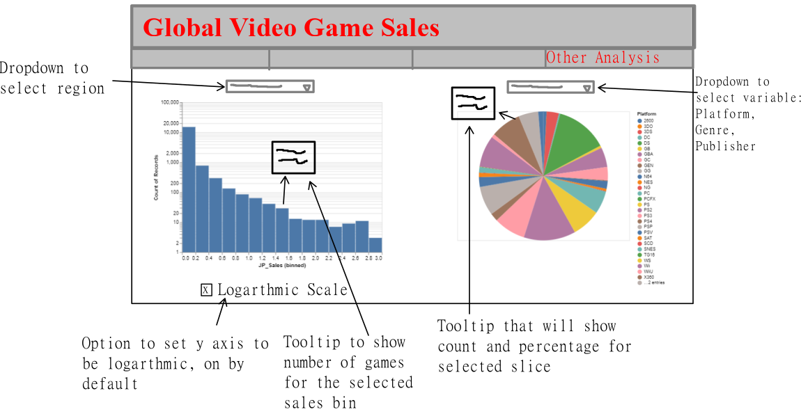

# VGsalesDashboard
A dashboard for video game sales using Dash.

## App Description

The main page of the dashboard will be a map of the world that is colored like a heatmap based on total game sales. On the right hand side, there will be a line plot (with a confidence interval ribbon) showing global sales over time. As the user drags their mouse over the available regions, the line plot will update to show the sales for that particular region. A two-sided slider on the bottom will allow the user to select the date range that they would like to view.

The second page will have a heatmap. A dropdown menu on the left-hand side will allow users to select what they want to display on the x and y axes. Options will be `genre`, `publisher` and `platform`. A two-sided slider will allow the user to filter on year.

The third page will have a bar chart showing the sales (in dollars) of the top 5 best-selling games. A menu on the left-hand side will allow the user to filter by `region`, `year`, `genre`, `publisher` and `platform`. A slider on the bottom will allow the user to choose how many games are shown (ie. 1-20). When the user hovers over a bar, the full name of the game is displayed, as well as the sales of that game in dollars (game names are truncated on x axis).

The last/fourth page will have both a histogram (left-hand side) and a pie chart (right-hand side). The histogram will show the distribution of sales. A dropdown above the plot will allow users to filter by region. A tick box below will allow users to log-scale the y axis. The pie chart will show the breakdown of several categorical variables. A dropdown above will allow users to select either `genre`, `Publisher` or `Platform`. 

## App Sketch

### Page 1

### Page 2

### Page 3

### Page 4

## Other Files

You can find our `Code of Conduct` [here](./project_guidelines/CODE_OF_CONDUCT.md).

You can find our `Team Contract` [here](./project_guidelines/team-contract.md).

You can find our `Contributions` document [here](./project_guidelines/CONTRIBUTING.md).
